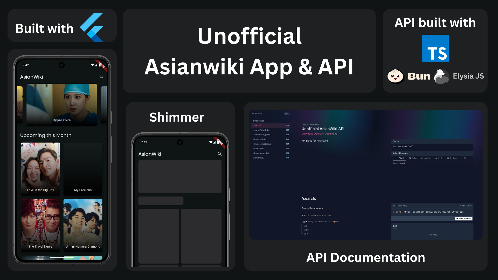

    <h1>AsianWiki App</h1>
    
Unofficial a Mobile version of <a href="https://asianwiki.com/Main_Page">AsianWiki.com.</a>
     
    Part of project <a href="https://github.com/Mufiidz/AsianWikiApi">AsianWiki API.</a>
    

---

  

Screenshots of app? See [here](/screenshots).

## Features

- Amazing Slider (Home)
- Upcoming Drama (Home)
- Search Drama & Movie (Search)
- Detail Drama & Movie (Detail Show)
- Search Drama & Movie Cast (Detail Show)

## Tech Stack & Library

- [injectable](https://pub.dev/packages/injectable) for Dependency Injection.
- [BLoC](https://pub.dev/packages/bloc) for BLoC Design Pattern (Business Logic Component).
- [Retrofit](https://pub.dev/packages/retrofit) for HTTP Client.
- [dart_mappable](https://pub.dev/packages/dart_mappable) for creating models.
- [logger](https://pub.dev/packages/logger) for A logger.
- [easy_localization](https://pub.dev/packages/easy_localization) for Localization.
- [drift](https://pub.dev/packages/drift) for local storage.
- Used AndroidX, Jetpack Compose, Material Design Components 3, and [any more libraries](pubspec.yaml).

## Data Source

AsianWiki App using the [Unofficial AsianWiki API](https://github.com/Mufiidz/AsianWikiAPI) for constructing RESTful API. 
Unofficial AsianWiki API provides a RESTful API interface to highly detailed objects built from thousands of lines of data related to asianwiki.

## Lessons Learned

Throughout building this app, I explored and learned:

- New shared preferences (SharedPreferencesAsync & SharedPreferencesWithCache) - [Shared preference docs.](https://pub.dev/packages/shared_preferences#sharedpreferences-vs-sharedpreferencesasync-vs-sharedpreferenceswithcache)
- Custom widget shimmer - [refer here.](https://docs.flutter.dev/cookbook/effects/shimmer-loading)
- Best practice to using constant file - [refer here.](https://stackoverflow.com/questions/54069239/whats-the-best-practice-to-keep-all-the-constants-in-flutter)
- Organize my app styles, inspired by [this article.](https://medium.com/@kanellopoulos.leo/a-simple-way-to-organize-your-styles-themes-in-flutter-a0e7eba5b297)
- Deeplink, but still not yet understand about this, especially deeplink for iOS [refer to this.](https://docs.flutter.dev/ui/navigation/deep-linking)
